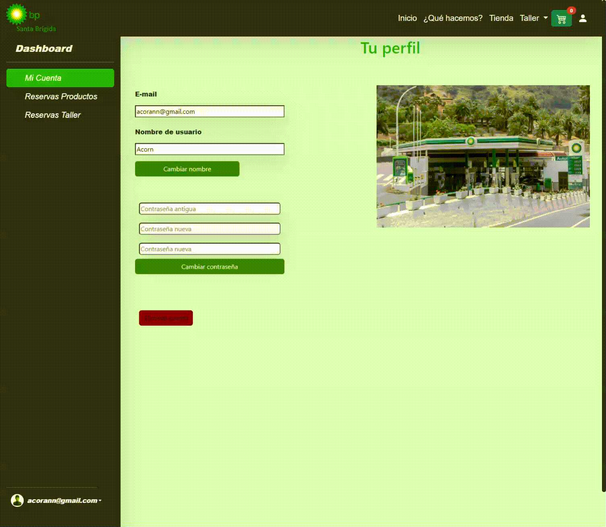

<h1 align="center">Gasolinera Online </h1>


<p align="center"> 
  
 
 


</p>

<p>La Aplicación de Gasolinera Online es un proyecto que utiliza las tecnologías de Angular| Ionic | Firebase para brindar una experiencia moderna y eficiente a los usuarios que deseen acceder a los servicios de una gasolinera de forma digital. Con una interfaz intuitiva y funcionalidades avanzadas</p>


## Contenido
<div>

  <h3>1.Presentación</h3>
  <h3>2.Funciones</h3>
  <h3>3.Ejecución</h3>
  <h3>4.Notas</h3>
 
</div>

## Presentación

### Inicio

<p align="center">
     
</p>

### Tienda
<p align="center">
     
</p>

### Taller
<p align="center">
     
</p>


### Perfil
<p align="center">
     
</p>


## Funciones
  <li>Función de logueo y registro</strong></li>
  <li>Función de reserva de productos tanto de taller como de tienda</li>
  <li>Función de reserva de servicios de taller</li>
  <li>Función de administración de perfil usuario</li>
  <li>Función modo administrador</li>

## Ejecución
### Pasos:

  #### Clonar Repositorio
  ```
  git clone https://github.com/AcoranGonzalezMoray/ServicioGasolineraOnline.git
  ```

  #### Instalar dependencias del proyecto
  ```
  npm install
  ```
 
 #### Ejecutar proyecto angular
  ```
  ng serve -o
  ```


## Notas
Este proyecto ha sido desarrollado utilizando los siguientes frameworks:

<strong>Angular:</strong> Un potente framework de JavaScript para construir aplicaciones web de una sola página (SPA). Proporciona una estructura sólida y herramientas eficientes para el desarrollo de interfaces de usuario interactivas. Pincha <a href="https://angular.io/">aquí</a> para más información.

<strong>Ionic:</strong> Un framework de desarrollo de aplicaciones móviles y web que utiliza Angular como base. Ionic permite la creación de aplicaciones híbridas y multiplataforma, utilizando tecnologías web como HTML, CSS y JavaScript. Pincha <a href="https://ionicframework.com/">aquí</a> para más información.

<strong>Firebase:</strong> Una plataforma de desarrollo de aplicaciones móviles y web que ofrece una amplia gama de servicios y herramientas, incluyendo almacenamiento en la nube, autenticación de usuarios, bases de datos en tiempo real, alojamiento web y más. En este proyecto, Firebase se ha utilizado para el almacenamiento de datos y la autenticación de usuarios. Pincha <a href="https://firebase.google.com/">aquí</a> para más información.

Estos frameworks han sido seleccionados por su robustez, eficiencia y popularidad en el desarrollo de aplicaciones web modernas. Han contribuido significativamente a la creación de este proyecto, proporcionando una base sólida y funcionalidades clave para su funcionamiento.

Para obtener más información sobre cómo utilizar estos frameworks en el proyecto, consulta la documentación oficial de cada uno de ellos.